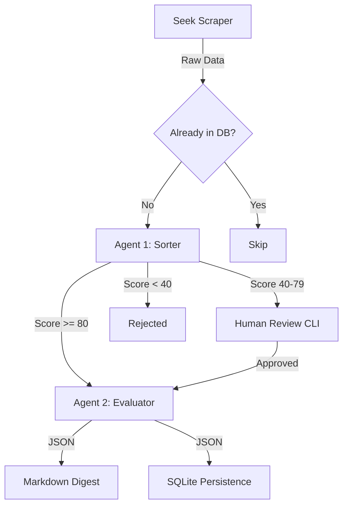

# System Design Document: Project Vector
**Status:** Baseline Specification (Aligned)

## 1. Executive Summary
Project Vector is an automated job discovery engine designed to filter high-value technical supply chain and analytics roles from generic operational positions. It uses a tiered AI pipeline to balance cost efficiency with deep qualitative analysis.

## 2. Core Architecture
The system follows a **Scrape -> Triage -> Analyze -> Persist** flow.

### 2.1 The Collector (Web Scraper)
*   **Technology:** Python 3.13 + Playwright (Headless Browser).
*   **Target:** Initially Seek.co.nz (New Zealand).
*   **Search Strategy (Cascading):**
    *   **Priority 1:** Greater Hamilton, Waikato, and 100% Remote (NZ-wide).
    *   **Priority 2:** Rest of North Island (Excluding Auckland preference).
    *   **Priority 3:** South Island (Expansion tier).
*   **Configuration:** `SEARCH_CONFIG.yaml` will define keywords, location IDs, and expansion toggles.
*   **Logic:**
    *   Bypasses basic bot detection using stealth configurations.
    *   Implements random jitter (1-5s) to avoid detection.
    *   Extracts: `job_title`, `company`, `location`, `raw_description_text`, `url`, `posting_date`.

### 2.2 The Triage Pipeline (Agent 1 & Agent 2)
Both agents are governed by `DOCTRINE.md`.

*   **Agent 1: The Sorter (Cost-Optimized)**
    *   **Model:** `gpt-4o-mini` or equivalent.
    *   **Input:** Raw job description + Doctrine.
    *   **Output:** JSON {`score`: 0-100, `rationale`: "String"}.
    *   **Action Paths:**
        *   **High-Pass (>=80):** Immediate promotion to Agent 2.
        *   **Edge Case (40-79):** Saved for Human Review via CLI.
        *   **Low-Pass (<40):** Logged to DB, otherwise ignored.

*   **Agent 2: The Evaluator (Reasoning)**
    *   **Model:** `claude-3-5-sonnet` or `gpt-4o`.
    *   **Trigger:** High-Pass results or Human-Promoted Edge Cases.
    *   **Function:** Deep qualitative analysis.
    *   **Output:** Validated JSON (see Schema in Section 3).

## 3. Data Schema & Persistence
*   **Database:** SQLite (`vector.db`).
*   **Tables:**
    *   `jobs`: Stores raw scraped data, triage scores, and final analysis.
    *   `audit_log`: Tracks scrape runs and API costs.

### JSON Output Schema (Final)
```json
{
  "job_title": "String",
  "company_name": "String",
  "url": "String",
  "overlap_score": "Integer (1-10)",
  "key_tech_stack": ["String"],
  "red_flags": ["String"],
  "architectural_opportunity": "String (One-sentence summary)"
}
```

## 4. Operational Workflow
1.  **Run Scraper:** `python main.py scrape`
2.  **Review Edge Cases:** `python main.py review` (CLI interactive prompt).
3.  **Generate Digest:** `python main.py digest` (Exports `digests/YYYY-MM-DD_report.md`).

## 5. Technical Doctrine (`DOCTRINE.md`)
The system prompts are constructed by reading this file.
*   **Positive Weight (Scale):** Automation, Architecture, Strategy, Systems Design, ETL, Data Modeling.
*   **Negative Weight (Toil):** Data Entry, Manual Reconciliation, Excel-only reporting, Routine Admin.
*   **Geographic Weights:**
    *   **Reward:** Hamilton/Waikato (Bonus to `overlap_score`).
    *   **Penalty:** Auckland (Heavy penalty unless "100% Remote" is explicitly verified).
    *   **Neutral:** Other NZ regions.

## 6. Data Flow Diagram (Mermaid)


## 7. Next Steps (Implementation Roadmap)
1.  Initialize `DOCTRINE.md`.
2.  Set up SQLite schema.
3.  Implement Playwright scraper for Seek.
4.  Implement Agent 1 Triage logic.
5.  Implement CLI Review & Markdown generation.
