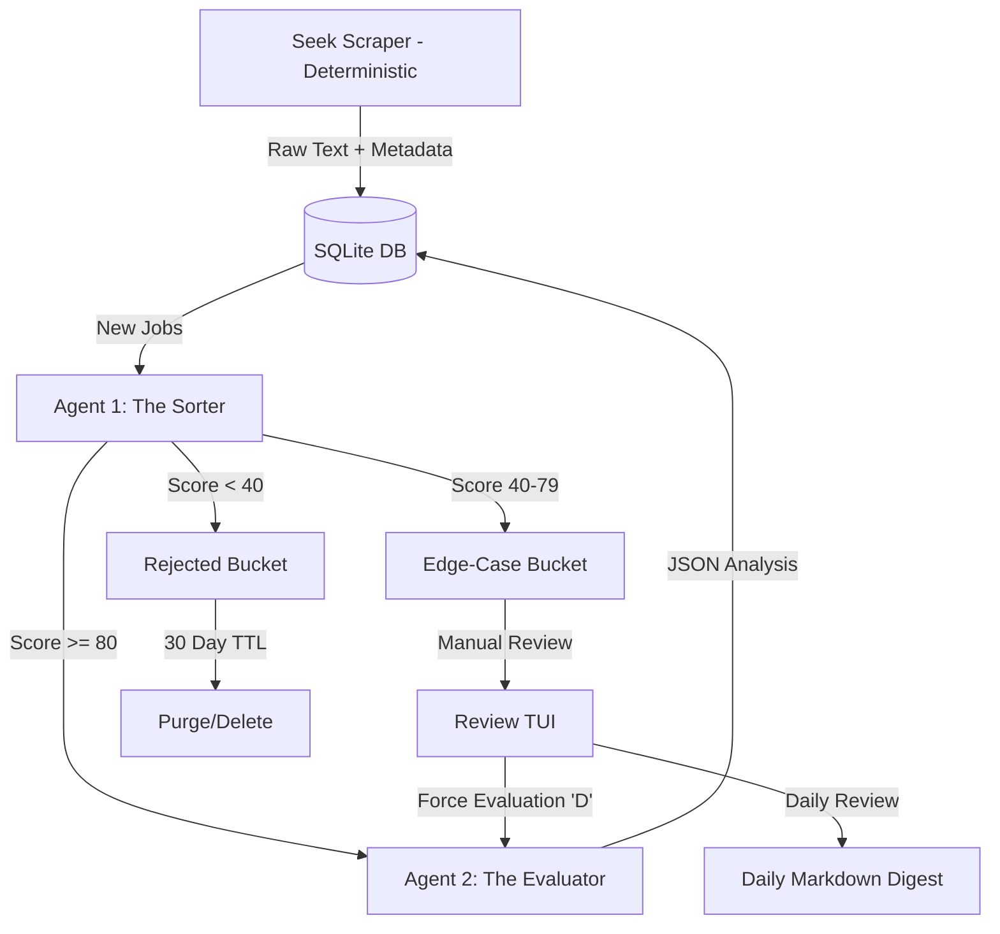

# Project Vector: Technical Specification & System Design Document (SDD)

## 1. System Architecture Overview
Project Vector is a dual-stage, agentic pipeline designed to automate the discovery and qualitative evaluation of technical supply chain and analytics roles. It prioritizes deterministic reliability in scraping and cost-efficient probabilistic evaluation through tiered LLM orchestration.

### Data Flow Diagram (Mermaid.js)


## 2. Recommended Tech Stack
- **Language:** Python 3.12+ (managed via `uv`).
- **Scraper:** `httpx` for requests, `BeautifulSoup4` for deterministic parsing.
- **Database:** `SQLite` (local, lightweight, supports JSON types).
- **TUI:** `Textual` (for high-fidelity dashboard and background workers).
- **LLM Client:** LiteLLM or direct SDKs for Gemini/OpenAI.
- **Environment:** `.env` for API keys and configuration.

## 3. The "Doctrine" System Prompts

### Agent 1 (The Sorter) - Triage Prompt
> **Role:** Technical Triage Officer.
> **Input:** Job Title, Company, Location, Raw Description.
> **Logic:** Evaluate against DOCTRINE.md. 
> **Scoring:** 
> - 80+: High-impact technical/architectural roles.
> - 40-79: Technical roles with potential manual overhead (Edge-Case).
> - <40: Purely manual, administrative, or non-technical finance roles.
> **Output:** `{"score": int, "rationale": "string"}`

### Agent 2 (The Evaluator) - Synthesis Prompt
> **Role:** Senior Technical Architect.
> **Goal:** Extract qualitative value and verify technical depth.
> **Output Requirements:** Must return the following JSON structure:
> ```json
> {
>   "verdict": "shortlisted | discarded",
>   "overlap_score": 1-10,
>   "role_type": "string",
>   "technical_depth": "2-3 sentence summary",
>   "architectural_opportunities": ["list"],
>   "key_tech_stack": ["list"],
>   "red_flags": ["list"],
>   "remote_status": "Verified | Likely | Unlikely"
> }
> ```

## 4. Implementation Strategies

### 4.1. Deterministic Scraper (Seek Module)
- **Constraint:** Fail-fast. If the CSS selector for the job description fails, the script must raise a `SelectorNotFoundError` and terminate.
- **Rate-Limiting:** Implement a random jitter (2-5 seconds) between requests to mimic human browsing behavior and avoid IP blocking.
- **Metadata Extraction:** Prioritize extracting `published_at` to calculate the `expiration_date`.

### 4.2. Database Schema (SQLite)
- `jobs` table:
    - `id` (PK)
    - `external_id` (Unique - from Seek)
    - `status` (`new`, `high-pass`, `edge-case`, `rejected`, `shortlisted`, `discarded`)
    - `last_decision_by` (`robot`, `human`)
    - `expiration_date` (DATETIME)
    - `raw_text` (TEXT)
    - `analysis_json` (JSON/TEXT)
    - `created_at` (TIMESTAMP)

### 4.3. Lifecycle Management (The "Clean Sweep")
- A standalone maintenance script (or TUI background worker) executes:
  `DELETE FROM jobs WHERE expiration_date < CURRENT_TIMESTAMP AND status IN ('rejected', 'discarded');`
- This ensures that if a rejected job is reposted *after* 30 days, it is treated as a fresh discovery.

## 5. Edge Cases & Risks
- **Duplicate Listings:** Handle via `external_id` uniqueness.
- **LLM JSON Failure:** Wrap LLM calls in a retry loop with a "Repair Prompt" if the JSON is malformed.
- **UI Drift:** Scraper must be unit-tested against saved HTML snapshots of Seek pages to detect breaking changes immediately.
